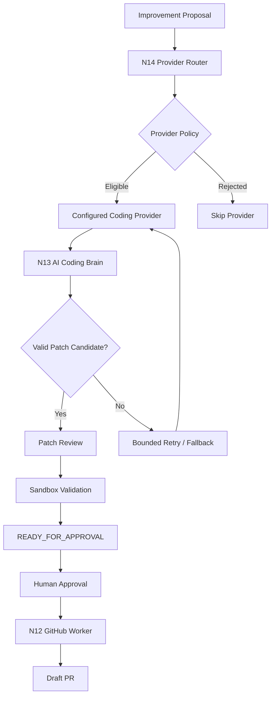

# N14 — Production Coding Provider Layer

## Purpose

N14 adds a bounded provider-routing layer above the N13 AI Coding Brain. It keeps provider
selection, configuration, capability filtering, cost policy, retry handling, fallback, and
secret-safe configuration separate from the autonomous coding policy core.

N14 does not bypass the safety boundaries established by N13, N12, or the approval lifecycle.

## System architecture

## Provider policy boundary

The router can evaluate a provider using:

- provider availability and configuration;
- declared task/capability compatibility;
- configured cost and retry policy;
- bounded fallback rules;
- secret-safe references to credentials.

A provider that is unavailable or not eligible is skipped rather than replaced by an
implicit or fabricated provider.

## Safety boundary

Provider routing never grants additional authority. Generated changes still pass the existing
patch-review and sandbox-validation gates, and a successful candidate still requires human
approval before N12 performs remote GitHub mutation.

## Operational boundary

A real external coding-model execution requires an operator-configured provider route and its
required credentials. The repository intentionally treats missing provider configuration as
unavailable rather than claiming execution succeeded.
