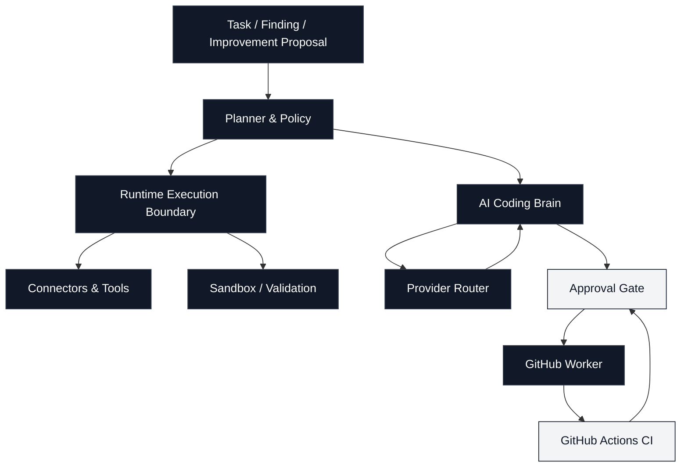
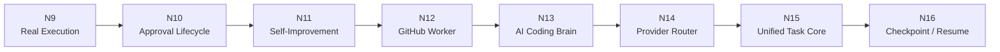
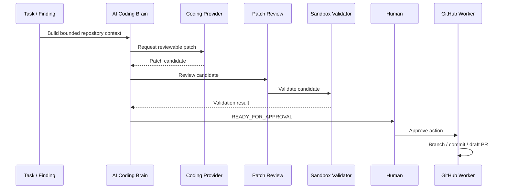
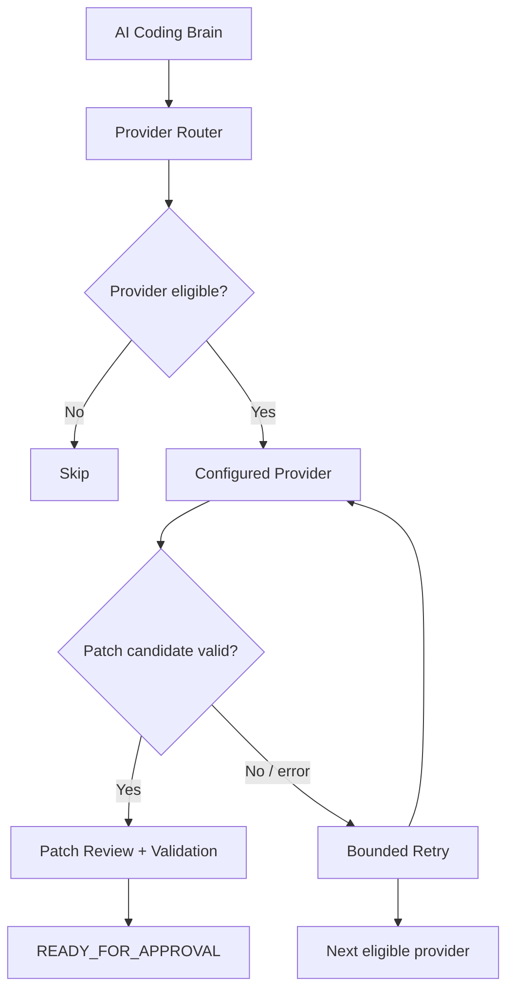
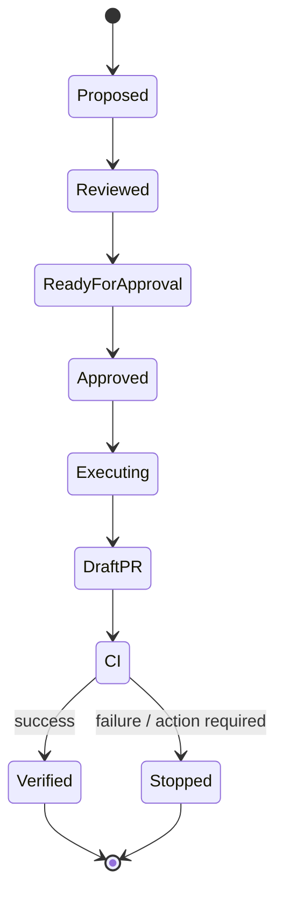
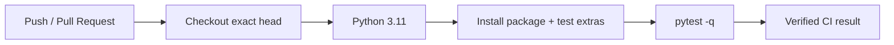

# Autonomous AI Scout

> A free-first autonomous engineering agent for discovery, repository auditing, controlled execution, AI-assisted coding, and human-approved GitHub changes.

[](https://github.com/Pappu246/autonomous-ai-scout/actions/workflows/ci.yml)
[](https://www.python.org/)
[](https://github.com/Pappu246/autonomous-ai-scout)
[](https://github.com/Pappu246/autonomous-ai-scout)

Autonomous AI Scout is built around a simple idea: **let software agents do useful engineering work without giving them unrestricted control of the repository or infrastructure.**

It can discover opportunities, inspect projects, plan bounded work, execute approved actions, generate patch candidates, validate them, and prepare GitHub changes. Sensitive transitions remain explicit and human-controlled.

---

## Architecture

The system is deliberately layered. Each layer has a narrower responsibility and a clear boundary.



### The important boundary

```text
DISCOVER
   │
   ▼
PLAN
   │
   ▼
EXECUTE SAFELY
   │
   ├──────────────► READ / AUDIT / REPORT
   │
   └──────────────► PROPOSE CHANGE
                         │
                         ▼
                   GENERATE PATCH
                         │
                         ▼
                    REVIEW PATCH
                         │
                         ▼
                   RUN VALIDATION
                         │
                         ▼
                 READY FOR APPROVAL
                         │
                         ▼
                  HUMAN APPROVAL
                         │
                         ▼
                   GITHUB WORKER
                         │
                         ▼
                      DRAFT PR
                         │
                         ▼
                         CI
```

The agent does **not** jump directly from a model response to a merge or deployment.

---

## From N9 to N16

The current engineering stack is the result of six bounded layers added on top of the earlier scout and execution system.

| Layer | Capability | What it adds |
|---|---|---|
| **N9** | Real Execution | Turns plans into controlled runtime actions |
| **N10** | Approval Lifecycle | Tracks proposal → approval → action → verification |
| **N11** | Self-Improvement | Produces bounded patch candidates and validates revisions |
| **N12** | GitHub Worker | Handles approved branch/commit/draft-PR work and observes CI |
| **N13** | AI Coding Brain | Builds repository context and generates reviewable patch candidates |
| **N14** | Provider Router | Selects configured coding providers with policy, retry, and fail-closed rules |
| **N15** | Unified Autonomous Task Core | Provides one canonical task planning/execution entry point over the existing boundaries |
| **N16** | Durable Checkpoint & Resume | Persists non-secret execution progress and resumes after interruption without replaying verified completed steps |
| **N17** | Dynamic Tool Selection Router | Selects the narrowest registered tool set from the task request without widening authorization |

### N9 → N14 flow



The N9→N14 layers are implemented. The remaining production work is configuration, live-provider validation, and operating the complete chain against a real repository.

These are implementation boundaries, not claims that every possible autonomous workflow is complete.

---

## What it can do

### Discovery & scouting

- Verify free-access claims against official provider sources.
- Track source changes.
- Maintain a registry of configured models.
- Benchmark configured free routes when credentials are explicitly supplied.
- Audit public GitHub projects.
- Track opportunity scores and score history.
- Produce Markdown reports.
- Optionally send reports through Gmail SMTP.

### Controlled execution

- Convert bounded plans into tool calls.
- Apply capability and safety policies before execution.
- Run controlled filesystem, Gmail, Calendar, and browser workflows through injected boundaries.
- Record bounded runtime history.
- Retry only within defined limits.
- Fail closed when required information or validation is missing.

### AI-assisted coding



The coding layer is intentionally **proposal-first**. A model does not receive unrestricted repository write access.

---

## Provider routing

N14 sits above the coding provider abstraction rather than coupling the agent to one model vendor.



Provider configuration is environment-based. Secrets are not stored in scout state.

Example configuration shape:

```text
CODING_PROVIDER_1_NAME=provider-name
CODING_PROVIDER_1_ENDPOINT=https://...
CODING_PROVIDER_1_MODEL=model-name
CODING_PROVIDER_1_API_KEY_ENV=PROVIDER_API_KEY
CODING_PROVIDER_1_COST_CLASS=free
CODING_PROVIDER_1_PRIORITY=10
CODING_PROVIDER_1_MAX_ATTEMPTS=2
CODING_PROVIDER_1_TIMEOUT_SECONDS=60
```

The router supports explicit free/paid policy handling. Paid routes are not silently enabled as a fallback.

---

## Safety model

The project treats autonomy as a set of permissions, not a single switch.

| Area | Agent behaviour |
|---|---|
| Repository inspection | Allowed within bounded context |
| Secret handling | Environment-only; redaction where context is built |
| Model-generated code | Candidate only |
| Patch review | Required before approval |
| Validation | Required before approval |
| Git branch / commit | Worker-controlled after approval |
| Draft PR | Worker-controlled after approval |
| Merge | Outside the worker |
| Deployment | Outside the worker |
| Billing / payment | Blocked |
| Authentication bypass | Blocked |
| Destructive actions | Policy / approval gated |

### AI coding boundary

```text
Repository
   │
   ├── read selected files
   ├── redact sensitive material
   ├── build bounded context
   │
   ▼
AI Coding Brain
   │
   ▼
PatchCandidate
   │
   ├── review
   ├── validation
   └── bounded revision
   │
   ▼
READY_FOR_APPROVAL
```

This boundary is important: **generated code is data until the approval and execution layers accept it.**

---

## GitHub worker lifecycle



The worker observes CI and PR state, but it does not turn a successful CI run into an automatic merge or deployment.

---

## Runtime model

```text
                 ┌──────────────────────┐
                 │     User / Schedule  │
                 └──────────┬───────────┘
                            │
                            ▼
                 ┌──────────────────────┐
                 │   Autonomous Scout   │
                 └──────────┬───────────┘
                            │
             ┌──────────────┼──────────────┐
             ▼              ▼              ▼
        Discovery        Runtime       Reporting
             │              │              │
             │        ┌─────┴─────┐        │
             │        ▼           ▼        │
             │      Tools      Sandbox     │
             │        │           │        │
             └────────┴─────┬─────┴────────┘
                             ▼
                       Audit / State
```

The scheduled scout and the engineering execution stack share the same conservative philosophy: explicit capabilities, bounded operations, observable results.

---

## Repository layout

```text
autonomous-ai-scout/
├── autonomous_agent/
│   ├── task_core.py
│   ├── execution_checkpoint.py
│   ├── tool_router.py
│   ├── runtime.py
│   ├── main.py
│   ├── provider_router.py
│   ├── coding_provider.py
│   ├── ai_coding_brain.py
│   ├── sandbox_runner.py
│   ├── github_worker.py
│   ├── self_improvement.py
│   └── ...
│
├── tests/
│   ├── test_provider_router.py
│   └── ...
│
├── .github/
│   └── workflows/
│       └── ci.yml
│
├── N14_PROVIDER_ROUTER.md
├── pyproject.toml
└── README.md
```

The exact module set can evolve; the important split is between **agent orchestration, safety boundaries, providers, workers, and tests**.

---

## Validation

CI runs the project's Python test suite on pushes and pull requests.



Local validation:

```bash
python -m pip install -e '.[test]'
pytest -q
```

Runtime examples:

```bash
python -m autonomous_agent.runtime "inspect repository"
python -m autonomous_agent.runtime --history
python -m autonomous_agent.main
```

The CI workflow also verifies that the checkout matches the expected commit before running tests.

---

## Configuration

Optional integrations are enabled only when their required environment variables or GitHub Actions secrets exist.

```text
GEMINI_API_KEY       # configured free-route benchmarking
SMTP_USERNAME        # Gmail sender
SMTP_APP_PASSWORD    # Gmail app password
REPORT_EMAIL         # report destination
```

Coding providers use the `CODING_PROVIDER_N...` environment configuration described above.

The concrete GitHub worker backend uses `GITHUB_TOKEN` (or the variable named by `GITHUB_TOKEN_ENV`) and the existing approval/identity/digest guards remain in front of every remote mutation.

Missing credentials should result in a skipped capability, not an invented or hidden fallback.

---

## Engineering principles

**Bounded over unrestricted.**  
Every autonomous capability has a defined scope.

**Observable over magical.**  
Important transitions produce inspectable state, results, or validation output.

**Fail closed.**  
Unknown, missing, invalid, or unsafe conditions stop the action rather than silently widening permissions.

**Human approval at consequential boundaries.**  
Generating a patch is not the same thing as accepting it.

**Provider-neutral core.**  
The coding brain talks to a provider abstraction instead of hard-coding the entire agent around one vendor.

**Tests are part of the feature.**  
A capability is not treated as complete merely because the implementation exists.

---


## Live coding path

The repository now has a concrete, bounded path from a local checkout to a reviewable coding proposal:

```text
improvement proposal
        │
        ▼
autonomous-scout-code
        │
        ▼
provider router
        │
        ▼
AI coding brain
        │
        ▼
patch review
        │
        ▼
sandbox validation
        │
        ▼
READY_FOR_APPROVAL
        │
        ▼
persisted coding run
        │
        ▼
explicit approval CLI
        │
        ▼
approved GitHub worker
        │
        ├── create dedicated branch
        ├── create one Git tree + commit
        └── open draft PR
```

Run the proposal-first coding path against a local checkout:

```bash
autonomous-scout-code \
  --root . \
  --project owner/repository \
  --severity medium \
  --title "CI regression" \
  --detail "The test suite is failing in the affected area." \
  --recommendation "Fix the regression and add focused coverage." \
  --affected app.py tests/test_app.py \
  --base-branch main \
  --expected-head-sha "<exact 40-character origin/main SHA>"
```

A successful run persists its reviewed proposal, candidate patch, review result,
identity digests, approved base HEAD, and approval action under
`state/coding_runs/`. It prints the resulting `run_id` and `action_id`. It never
persists provider keys, GitHub credentials, approval tokens, arbitrary
environment values, or detected secret material.

The cross-process operational flow is deliberately explicit:

```bash
# Review the durable, non-secret operational status.
autonomous-scout-approval inspect <action_id>

# A human decision updates the existing approval queue/audit and the persisted run.
autonomous-scout-approval approve <action_id>
# or: autonomous-scout-approval reject <action_id>

# Rebuild the exact reviewed request and create one draft PR when every guard passes.
autonomous-scout-approval execute <action_id>
```

`execute` requires the persisted run to be `APPROVED`, its original coding run
to remain `READY_FOR_APPROVAL`, the current queue action and approval record to
match their stored digests, a valid lifecycle ledger, and the original project,
patch, file, and expected-HEAD identities to still match. The GitHub worker then
repeats its existing target-HEAD, duplicate-PR, and single-use approval checks.
It records `EXECUTING`, followed by `EXECUTED` or `FAILED`; rejected or invalid
runs remain terminal. A process interruption leaves an execution marker and does
not retry automatically. The worker creates only a draft PR and observes CI; it
never auto-merges or deploys.

## Current status

**Implemented through N16; N17 is on the phase branch and awaiting its dynamic-selection verification gate.**

N14 adds the production coding-provider routing layer. The repository now also contains a concrete GitHub REST worker backend and a local end-to-end coding CLI. A real external-model run and a real approved draft-PR run still require operator-supplied credentials and a target workspace.

N15 introduced the unified task-core boundary. N16 adds durable, non-secret execution checkpoints and resume semantics. N17 adds deterministic dynamic tool selection over the existing Tool Registry. Later autonomy features remain intentionally unimplemented until their respective phases are defined, implemented, tested, and verified.

---

## Documentation

- [N14 Provider Router](N14_PROVIDER_ROUTER.md)
- [N16 Durable Checkpoint & Resume](N16_DURABLE_CHECKPOINT_RESUME.md)
- [N17 Dynamic Tool Router](N17_DYNAMIC_TOOL_ROUTER.md)
- [GitHub Actions CI](.github/workflows/ci.yml)
- [Project configuration](pyproject.toml)

---

## License

See the repository for the current license and project terms.
